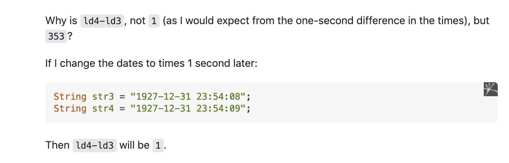

<h2> What is open source software? </h2>

   In today's day and age we all have the most information readily available at our fingertips than ever before in history. These are the days after the long legal process the idea of free and open software had to go through, until the software was finally implemented and released to the public in the 90's. The internet has birthed many forums and gathering places of knowledge and dialogue between programmers and coders alike. One of these forums is StackOverflow and on this platform users are able to engage in question and answer dialogue with the user posting a question regarding certain code, and the community can view and attempt to solve the problem.
  

<h2> Poor Example of a Question </h2> 

  In this example of a bad question, someone lets the forum know he is trying to override a built-in function in Javascript and he is asking anyone if they know how to do this. Before you even ask a question you should show some initiative and attempt to find a solution to your problem by looking on different forums or across the web instead of expecting it to be just handed to you. Another thing you can try do is look through the manual or oracle to see if you can find any information on the built in function in question.
  
  
  Along with not showing initiative, this programmer was very vague on what this function they want to override does, it's parent class or sub-class they are trying to over-ride it in, or what is going wrong within their code. It seems they haven't described any problems they are having with understanding the process of over-riding, they just want someone to help code it. It is important for someone else to know every caveat of the problem for them to best help you understand it and find a solution.

<h2> An improved question </h2>

  Now taking a look at a better question asked, we can see that they concisely and clearly state the steps they are taking in their code to help the reader know what is going on their code. They then display their source code they are dealing with which helps coders find small syntax errors and give people a better idea of the how the program works and the problem at hand. Some other good question asking attributes were that they didn't rush to claim they have found a bug but rather try to get to the bottom of it by describing the problem explicitly and asking the forum in a non-groveling way.
  
  
  Another good thing they do in this question is discuss the results they are getting and then compare that to the results they are aiming for, setting a goal for this program to accomplish rather than acquiring the steps needed for completing the goal. Then they question why the line is giving that output after displaying facts on why the program should work properly, showing he has attempted this problem thoroughly. In the end this question was a result of an abnormal case with a time zone change in the region of his software resulting in the bug.

Source for [Good Example Screenshots]("https://stackoverflow.com/questions/6841333/why-is-subtracting-these-two-times-in-1927-giving-a-strange-result"). 

Source for [Bad Example Screenshot]("https://stackoverflow.com/questions/5409428/how-to-override-a-javascript-function").

Source for [Brain image]("https://www.google.com/search?q=brain+cartoon&sxsrf=APq-WBtBWfjbHCO2LOwGNIMtPcDPs52Npg:1643366622776&source=lnms&tbm=isch&sa=X&sqi=2&ved=2ahUKEwjataTeodT1AhXlITQIHV0ADTEQ_AUoAXoECAEQAw&biw=1309&bih=595&dpr=2.2#imgrc=wvI8qoCGmnTlqM").
