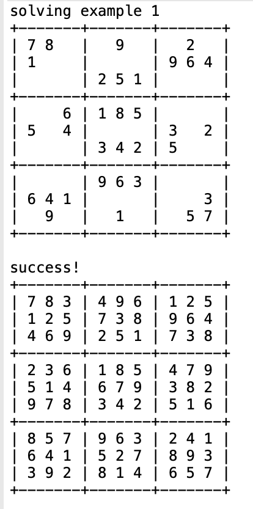

This Program was made whilst I was in ICS 211 and is made to recursively solve even the most difficult sudoku puzzles.

The program works by going to a cell and using a function that returns an ArrayList of integers that are legal values in that cell, which means it will be a unique number in it's row, column, and 3 x 3 box. Using this information in my recurisve solveSudoku() funtion which also utilizes a recursive helper method which goes through each empty cell in the puzzle, in  each cell it is also calling another function that checks if the puzzle is solved or not. If the checkSudoku() function return negative it will proceed until it is finsihed and checkSudoku() returns true.

The hardest parts I can remember from doing this project was the algorithm for checking the legal values of a cell in the 3 x 3 box, which seems pretty convoluted but I seemed to figure it out. Another aspect of this that was difficult was the concept of using my recursive method and also backtracking if there were no legal values for a cell and the code had to backtrack. Please feel free to view  the code for this project below.
 
[Sudoku Solver](https://github.com/Cole-House/Sudoku-Solver/tree/main).
